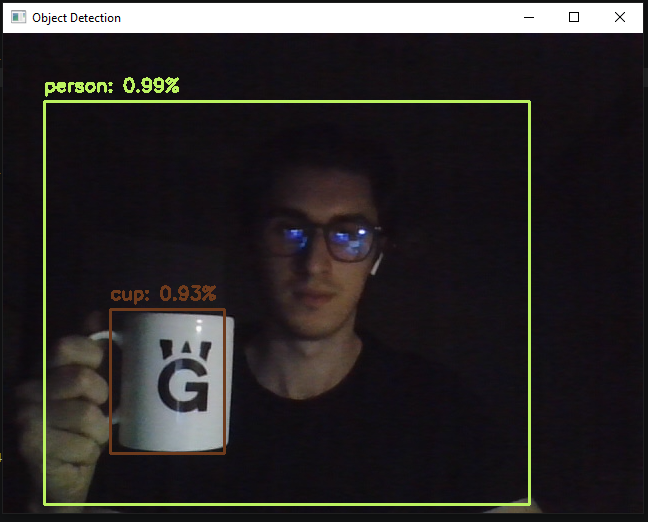
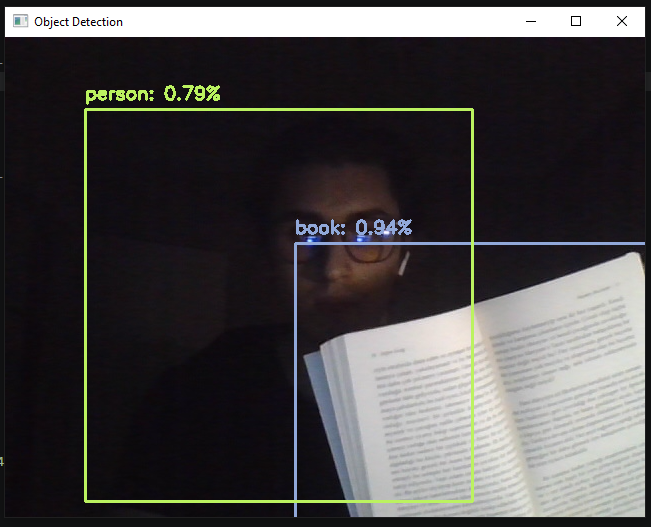
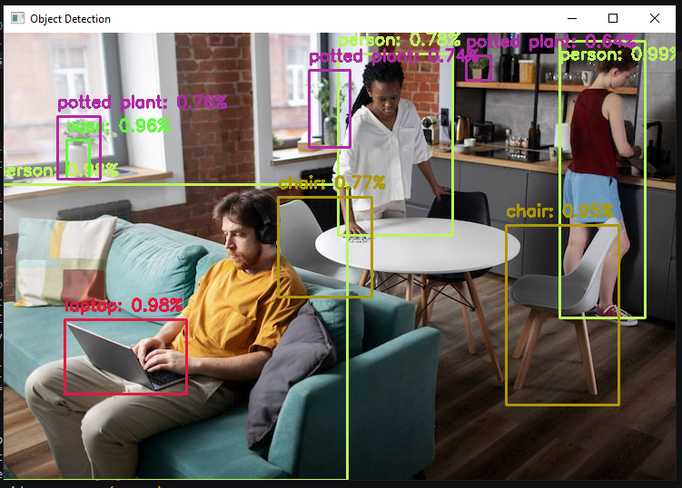

# Yapay Zeka ile Nesne Tespiti
Python, OpenCV, Numpy ve YOLOv3 nesne tespit modelini kullanarak resimlerden, videolardan veya canlı kameralardan nesneleri tespit eden görüntü analiz aracı.

## Özellikler
- 80 Farklı Nesne Sınıfı
- Resim, Video veya WebCam Üzerinden İşleme
- Görselleştirilmiş Çıktı ve Güven Düzeyi
- Hızlı kurulum
- Özelleştirilebilir Nesne Etiketleri

## Tespit Edilebilen Nesneler
İnsanlar, araçlar (araba, bisiklet, otobüs, uçak), hayvanlar (kedi, köpek, kuş, at), 
elektronik eşyalar (dizüstü bilgisayar, telefon, klavye), günlük nesneler 
(sırt çantası, şemsiye, kitap, kupa) ve daha fazlası.

### Örnekler
<p align="center">
  
  
  
</p>

## Kurulum
### Gereksinimler
- Python 3.7+
- OpenCV 4.x
- NumPy

### Adımlar
```bash
# 1. Repoyu klonla
git clone https://github.com/wolkansec/ai-object-detector
cd ai-object-detector

# 2. Modelin İndirilmesi ve Gereksinimlerin Kurulması 
wget https://pjreddie.com/media/files/yolov3.weights # (/model dizinine taşınması gereklidir!)
pip install -r requirements.txt

# 4. Projenin Çalıştırılması
python3 main.py
